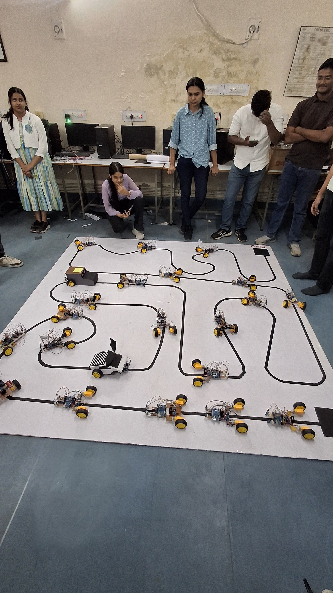
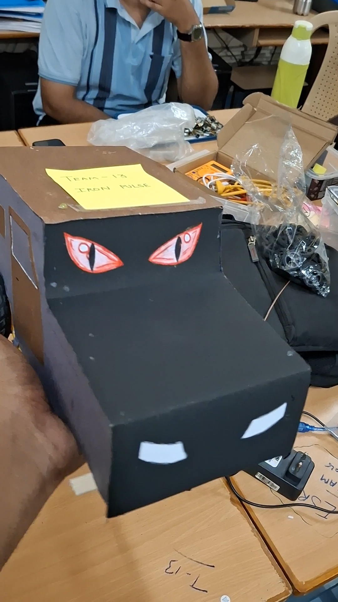

# 🤖 Arduino Line Follower Robot


An Arduino Uno based autonomous **Line Follower Robot** that detects and follows a black line using dual IR sensors and controls two DC motors through the **L298N Motor Driver**.

This project was developed during a robotics workshop to gain hands-on experience in embedded systems, Arduino programming, sensor interfacing, and motor control.

---

# 📌 Project Overview

The robot continuously reads data from two IR sensors mounted underneath the chassis.

Based on the sensor readings, the Arduino Uno controls the left and right DC motors through the L298N Motor Driver, allowing the robot to accurately follow a predefined black line on a white surface.

---

# ✨ Features

- 🤖 Automatic Line Following
- 🎯 Dual IR Sensor Detection
- ⚡ Differential Motor Speed Control
- 🔌 Arduino Uno Based
- 🚗 Dual DC Gear Motors
- 🛠️ Lightweight Modular Chassis
- 📚 Beginner-Friendly Arduino Code

---

# 🛠 Hardware Components

| Component | Quantity |
|-----------|---------:|
| Arduino Uno | 1 |
| L298N Motor Driver | 1 |
| IR Sensor Module | 2 |
| BO DC Gear Motor | 2 |
| Wheels | 2 |
| Robot Chassis | 1 |
| Castor Wheel | 1 |
| Jumper Wires | As Required |
| 12V Power Supply | 1 |

---

# 📸 Project Gallery

<p align="center">
  
  
</p>

<p align="center">
  
  
</p>

---

# 💻 Software Used

- Arduino IDE
- Arduino C/C++
- Embedded Systems Programming

---

# ⚙️ Working Principle

1. The IR sensors continuously detect the surface beneath the robot.
2. The sensors differentiate between the black line and the white background.
3. The Arduino processes the sensor inputs.
4. According to the detected path, the Arduino controls the left and right motors using the L298N Motor Driver.
5. The robot continuously adjusts its direction and follows the line automatically.

---

# 📂 Repository Structure

```
Line-Follower-Robot/
│
├── Docs/
│   └── README.md
│
├── Images/
│   ├── Project Images
│   └── README.md
│
├── Videos/
│   ├── Project Showcase Video
│   └── README.md
│
├── LineFollower.ino
├── LICENSE
└── README.md
```

---

# 📸 Project Images

The **Images** folder contains photographs of the project, including:

- Hardware Assembly
- Electronics Setup
- Robot Chassis
- Competition Arena
- Final Robot Body Design

---

# 🎥 Project Video

A short showcase video of the completed robot hardware is available in the **Videos** folder.

> **Note:** The uploaded video showcases the completed hardware assembly and overall robot design. It is intended as a hardware presentation and does not include a live line-following demonstration.

---

# 📖 Documentation

Additional documentation and project-related notes are available in the **Docs** folder.

---

# 🚀 Future Improvements

- PID Based Line Following
- Adjustable Speed Calibration
- Bluetooth Control
- Obstacle Detection
- Maze Solving Algorithm
- ESP32 Integration
- OLED Display Support

---

# 📄 License

This project is licensed under the **MIT License**.

---

# 👨‍💻 Author

**Yashwardhan Jangid**

B.Tech – Electronics & Communication Engineering

MBM University, Jodhpur

---

If you found this project helpful, consider giving this repository a ⭐ Star.
